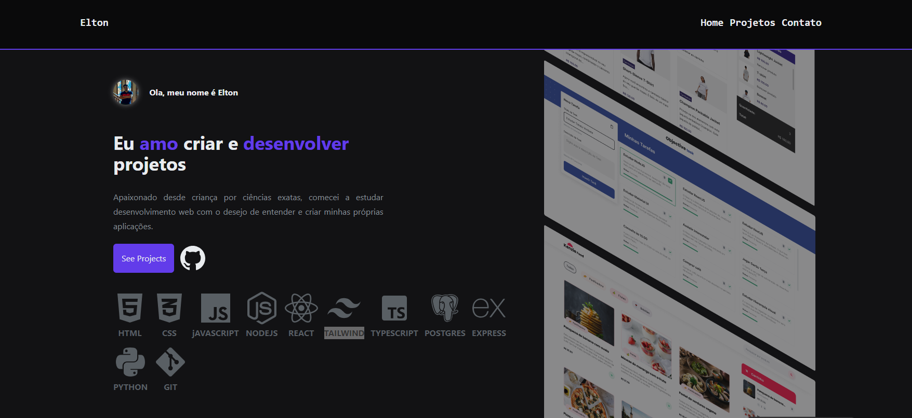

Projeto portifólio feito em [Next.js](https://nextjs.org/) e estilizado em [TAILWIND](https://tailwindcss.com/).

<h1 align="center">
  Elton Ferreira
</h1>

  

 A aplicação foi desenvolvida com o intuito de demonstrar habilidades Frontend e reunir os melhores projetos desenvolvidos durante a minha trajetória dev.
